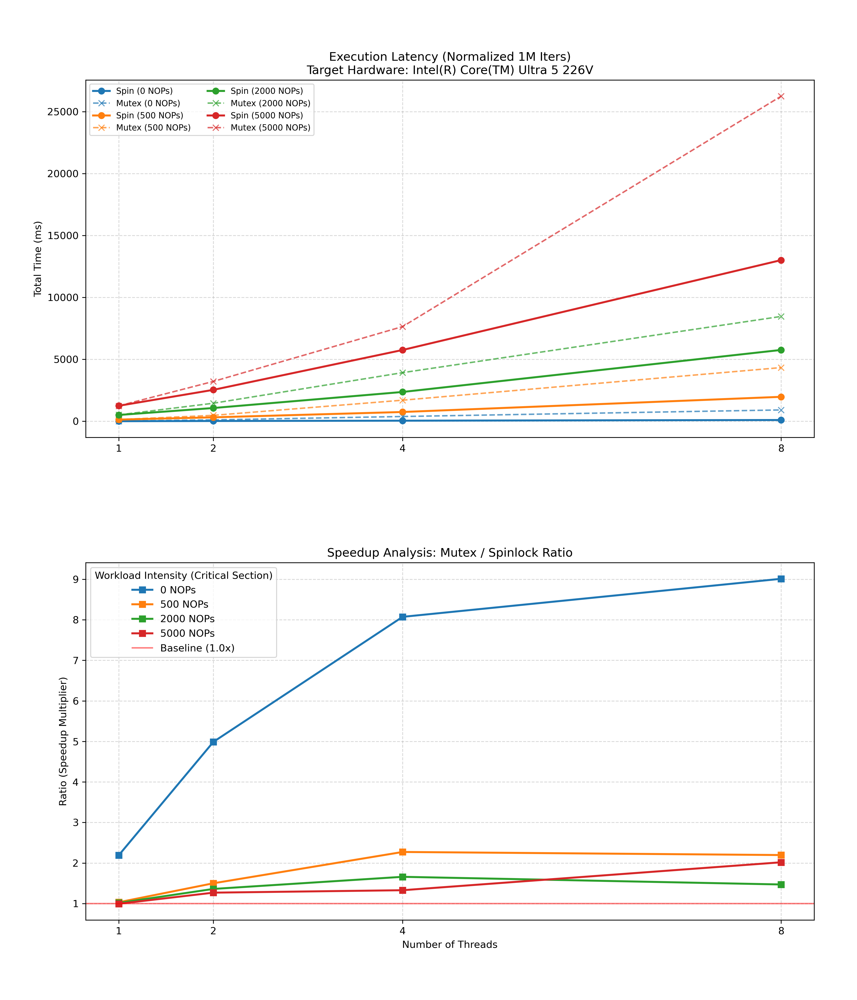

# Spinlock Implementation & Performance Test

This project provides a custom spinlock implementation using x86-64 inline assembly and compares its performance with POSIX mutex (`pthread_mutex`). The benchmark allows granular control over threading, iteration counts, and workload simulation via command-line arguments.

## Supported Platforms
- **Architecture**: x86-64 (Required for `pause` and `lock cmpxchgl` instructions)
- **OS**: Linux
- **Compiler**: GCC (Standard: `gnu99`)

## Build Instructions

The build system automatically handles output directory creation.

1. **Clean and Build**:
   ```bash
   make clean
   make all
   ```

2. **Artifacts**:
   The compiled binary is located in the `bin/` directory:
   - `./bin/spinlock_test`

## Usage & Options

Run the binary directly from the command line. If no arguments are provided, default values are used.

```bash
./bin/spinlock_test [options]
```

### Command-Line Arguments

| Option | Argument | Description | Default |
| :--- | :--- | :--- | :--- |
| `-t` | `<threads>` | **Thread Count**: Number of concurrent worker threads to spawn. | `4` |
| `-i` | `<iters>` | **Iterations**: Number of critical section entries per thread. | `1,000,000` |
| `-l` | `<loops>` | **Workload**: Number of `nop` instructions to execute inside the critical section (simulates load). | `500` |
| `-m` | `<min>` | **Min Backoff**: Initial spin count for the exponential backoff algorithm. | `4` |
| `-M` | `<max>` | **Max Backoff**: Maximum spin count before yielding the CPU (`sched_yield`). | `16,000` |
| `-h` | N/A | **Help**: Display usage information and exit. | N/A |

### Execution Examples

#### 1. Default Run
Use standard settings (optimized for general testing).
```bash
./bin/spinlock_test
```

#### 2. High Contention Test
Simulate heavy contention with 8 threads and a very short critical section.
```bash
./bin/spinlock_test -t 8 -l 0
```

#### 3. Long Critical Section Test
Simulate a scenario where the lock is held for a longer duration (10,000 nops), which typically favors Mutex over Spinlock.
```bash
./bin/spinlock_test -l 10000
```

#### 4. Tuning Backoff Algorithm
Adjust the exponential backoff parameters to optimize for specific hardware (e.g., Intel Core Ultra series).
```bash
./bin/spinlock_test -m 16 -M 4096
```

## Benchmark Results
*Test environment: Intel Core Ultra 5 226V, 4 Threads, 1M Iterations.*

| Scenario | Lock Type | Time (ms) | Speedup |
| :--- | :--- | :--- | :--- |
| **Short Critical Section** | Pthread Mutex | 368.433 | 1.0x |
| | **Custom Spinlock** | **73.588** | **5.0x** |
| **Long Critical Section** | Pthread Mutex | 979.098 | 1.0x |
| (500 nop loop) | **Custom Spinlock** | **360.128** | **2.7x** |

## Automated Benchmarking & Visualization
A Python-based automated runner (`test_bench.py`) is provided to analyze performance across various thread counts and workload intensities. It automatically generates a visual report.

### Real-World Performance (Intel Core Ultra 5 226V)
*Target System: 4 Cores / 8 Threads, Arch Linux*

| Workload Intensity (NOPs) | Threads | Spin (ms) | Mutex (ms) | Speedup |
| :--- | :--- | :--- | :--- | :--- |
| **0 (Extreme Contention)** | 8 | 98.18 | 903.82 | **9.21x** |
| **500 (Balanced)** | 4 | 686.60 | 1598.32 | **2.33x** |
| **2000 (Medium CS)** | 4 | 2391.82 | 3955.45 | **1.65x** |
| **5000 (Long CS)** | 8 | 12850.83 | 24676.96 | **1.92x** |


