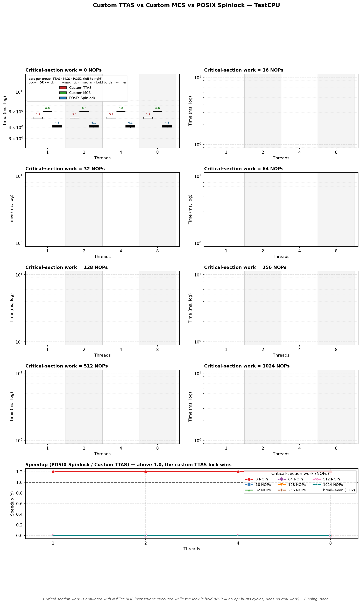

# Spinlock Implementation & Performance Test

This project provides a custom spinlock implementation using x86-64 inline assembly and compares its performance with POSIX mutex (`pthread_mutex`). The benchmark allows granular control over threading, iteration counts, and workload simulation via command-line arguments.

## Supported Platforms
- **Architecture**: x86-64 (Required for `pause` and `lock cmpxchgl` instructions)
- **OS**: Linux
- **Compilers**: GCC or Clang (Standard: `gnu17`)
- **Build Systems**: Make and CMake (≥ 3.16)
- **Build Modes**:
  - **Release**: `-O3 -Wall -Wextra -fno-omit-frame-pointer -fasynchronous-unwind-tables` — optimized for benchmarking with frame pointers and unwind tables preserved for `perf` and flame graphs.
  - **Trace/Debug**: adds `-O0 -g3 -fno-inline -fno-inline-functions -fno-optimize-sibling-calls -rdynamic` — every `static inline` helper resolves to a real call frame so `uftrace`, `gdb`, `strace`, and `perf` can step into each function.
- **Code Style**: LLVM-based `.clang-format` — right-aligned pointers, Allman function braces, K&R control flow, 100-column soft limit.

## Build Instructions

Either build system produces the same artifacts under `bin/`. Use GCC or Clang interchangeably.

### Make

```bash
make clean
make all              # builds both targets
# or build a single target:
make release          # ./bin/spinlock_test
make trace            # ./bin/spinlock_test_trace
```

Override the compiler with `make CC=clang all`.

### CMake

```bash
cmake -S . -B build
cmake --build build -j

# or with Clang:
CC=clang cmake -S . -B build
cmake --build build -j
```

### Artifacts (in `bin/`)
- `./bin/spinlock_test` — **release build**, used for benchmarking and the headline numbers below.
- `./bin/spinlock_test_trace` — **trace/debug build**, used with `uftrace`, `gdb`, `strace`, `perf`, and other analysis tools. Inlining is fully suppressed and `-rdynamic` exposes all symbols, so every helper appears as a real call frame.

## Usage & Options

Run the binary directly from the command line. If no arguments are provided, default values are used.

```bash
./bin/spinlock_test [options]
```

### Command-Line Arguments

| Option | Argument | Description | Default |
| :--- | :--- | :--- | :--- |
| `-t` | `<threads>` | **Thread Count**: Number of concurrent worker threads to spawn. | `4` |
| `-i` | `<iters>` | **Iterations**: Number of critical section entries per thread. | `1,000,000` |
| `-l` | `<loops>` | **Workload**: Number of `nop` instructions to execute inside the critical section (simulates load). | `500` |
| `-m` | `<min>` | **Min Backoff**: Initial spin count for the exponential backoff algorithm. | `4` |
| `-M` | `<max>` | **Max Backoff**: Maximum spin count before deferring to the scheduler via a bounded `nanosleep`. | `16,000` |
| `-h` | N/A | **Help**: Display usage information and exit. | N/A |

### Execution Examples

#### 1. Default Run
Use standard settings (optimized for general testing).
```bash
./bin/spinlock_test
```

#### 2. High Contention Test
Simulate heavy contention with 8 threads and a very short critical section.
```bash
./bin/spinlock_test -t 8 -l 0
```

#### 3. Long Critical Section Test
Simulate a scenario where the lock is held for a longer duration (10,000 nops), which typically favors Mutex over Spinlock.
```bash
./bin/spinlock_test -l 10000
```

#### 4. Tuning Backoff Algorithm
Adjust the exponential backoff parameters to optimize for specific hardware (e.g., Intel Core Ultra series).
```bash
./bin/spinlock_test -m 16 -M 4096
```

## Profiling & Tracing the Trace Build

The trace build (`./bin/spinlock_test_trace`) suppresses inlining and ships full debug info, so every `static inline` helper resolves to a real call frame. Common workflows:

```bash
# Function-level user-space trace (uftrace)
uftrace ./bin/spinlock_test_trace -t 8 -l 0 -i 100000

# Hot-path sampling with perf (DWARF call graph)
perf record -F 999 --call-graph dwarf ./bin/spinlock_test_trace -t 8 -l 0 -i 100000
perf report

# Single-step into spin_lock under gdb
gdb -ex 'b spin_lock' --args ./bin/spinlock_test_trace -t 2 -l 0 -i 1000

# Syscall summary
strace -c ./bin/spinlock_test_trace -t 4 -l 0 -i 100000

# Valgrind: memory errors, thread races, cache profile
valgrind --tool=memcheck --leak-check=full ./bin/spinlock_test_trace -t 2 -l 0 -i 1000
valgrind --tool=helgrind                    ./bin/spinlock_test_trace -t 4 -l 0 -i 1000
valgrind --tool=drd                         ./bin/spinlock_test_trace -t 4 -l 0 -i 1000
valgrind --tool=cachegrind                  ./bin/spinlock_test_trace -t 2 -l 500 -i 10000
```

Use `make distclean` to scrub every debugger / profiler / tracer artifact (cores, valgrind dumps, perf.data, uftrace.data, `__pycache__`, CMake residue, …) on top of `make clean`'s build-only sweep.

The release build (`./bin/spinlock_test`) is what `test_bench.py` exercises and what produces the headline numbers below.

## Benchmark Results
*Test environment: Intel Core Ultra 5 226V (8 cores / 8 threads), Arch Linux. Median of 7 runs (+ 1 discarded warmup), normalized to 1,000,000 lock/unlock cycles.*

### Headline (4 threads)

| Scenario | Lock Type | Time (ms) | Speedup |
| :--- | :--- | :--- | :--- |
| **Extreme contention (0 NOPs)** | Pthread Mutex | 394.8 | 1.0x |
| | **Custom Spinlock** | **51.2** | **7.7x** |
| **Short CS (200 NOPs)** | Pthread Mutex | 663.0 | 1.0x |
| | **Custom Spinlock** | **257.9** | **2.6x** |
| **Medium CS (2,000 NOPs)** | Pthread Mutex | 2,557.5 | 1.0x |
| | **Custom Spinlock** | **1,122.8** | **2.3x** |
| **Long CS (10,000 NOPs)** | Pthread Mutex | 7,624.0 | 1.0x |
| | **Custom Spinlock** | **5,290.9** | **1.4x** |

## Automated Benchmarking & Visualization
A Python-based automated runner (`test_bench.py`) sweeps thread counts × workload intensities, aggregates with **Median ± MAD** over **7 runs (+ 1 discarded warmup)**, and emits a textual report, an OHLC-style **candlestick** plot (`bench_result.png`), and a raw CSV of every measurement (`bench_results.csv`). Each candle encodes the full 7-run distribution per (threads, workload, lock) cell:

- **Body** = IQR (Q1 – Q3) — the typical run-to-run range
- **Wick** = min – max — the noise envelope (how far an outlier can drag a run)
- **Tick across the body** = median (the headline number)
- **Blue** = custom spinlock, **orange** = POSIX mutex (paired side-by-side at each thread count)

The bottom panel shows the corresponding speedup (mutex / spin) as a line plot per workload.

Workloads target modern x86 CPUs: `0` (lock acquire/release alone), `200` (very short CS, ≈50 ns at ~4 GHz), `2,000` (medium CS, ≈500 ns), and `10,000` (long CS, ≈2.5 µs).

### Real-World Performance (Intel Core Ultra 5 226V, 8 cores / 8 threads)

| Workload (NOPs) | Threads | Spin (ms) | Mutex (ms) | Speedup |
| :--- | :--- | :--- | :--- | :--- |
| **0** (extreme contention) | 2 | 18.94 | 147.41 | **7.78x** |
| **0** (extreme contention) | 8 | 160.27 | 852.89 | **5.32x** |
| **200** (short CS) | 4 | 257.93 | 662.98 | **2.57x** |
| **200** (short CS) | 16 (oversub.) | 4,494.89 | 3,074.73 | **0.68x** |
| **2,000** (medium CS) | 4 | 1,122.75 | 2,557.51 | **2.28x** |
| **2,000** (medium CS) | 8 | 2,918.94 | 6,067.52 | **2.08x** |
| **10,000** (long CS) | 8 | 12,048.50 | 17,034.20 | **1.41x** |
| **10,000** (long CS) | 16 (oversub.) | 31,038.19 | 34,382.52 | **1.11x** |

> **Reading the matrix.** The spinlock dominates from low to medium contention up to ~2 ms critical sections — at 4 threads with no CS work it is **7.7x faster** than `pthread_mutex`. Once the system is **over-subscribed** (more threads than physical cores) the bounded `nanosleep` yield can no longer keep spinning threads from starving the lock holder; with a short CS mutex clearly wins (0.68x), while at long CS the two stay within 11% of each other. Single-thread numbers are essentially identical across all workloads, as expected. The wick length in `bench_result.png` (and the log y-axis) makes the variance jump at over-subscription visible — that is exactly where you should reach for the kernel-mediated lock.

The full raw measurement table (280 rows: 4 workloads × 5 thread counts × 2 locks × 7 runs) is shipped as [`bench_results.csv`](bench_results.csv) for downstream analysis.



## Stability & Sanity Checks

The trace build (`./bin/spinlock_test_trace`) was exercised under several validators:

| Tool | Scope | Result |
| :--- | :--- | :--- |
| **Stress matrix** (5 thread × 3 workload × 2 iter × 2 lock = 60 runs) | atomic-count correctness | **60/60 OK** |
| **valgrind memcheck** (`--leak-check=full`) | memory errors / leaks | **0 errors** |
| **valgrind drd** | data races | **0 errors** |
| **valgrind helgrind** | data races | 8 warnings (false positives) |
| **AddressSanitizer + UBSan** (`-fsanitize=address,undefined`) | memory + UB | **clean, atomic count OK** |
| **ThreadSanitizer** (`-fsanitize=thread`) | data races | 4 warnings (false positives), atomic count OK |

The helgrind / TSan warnings are **expected**: both detectors only recognise synchronization expressed through `pthread` primitives or C11 `<stdatomic.h>`, and our spinlock acquires the lock through a raw `lock cmpxchgl` instruction with a `volatile`-qualified flag, which they cannot pattern-match. `drd` ignores them because of how it tracks vector clocks per memory access. None of the tools reported a memory error and every run produced the expected atomic count.
