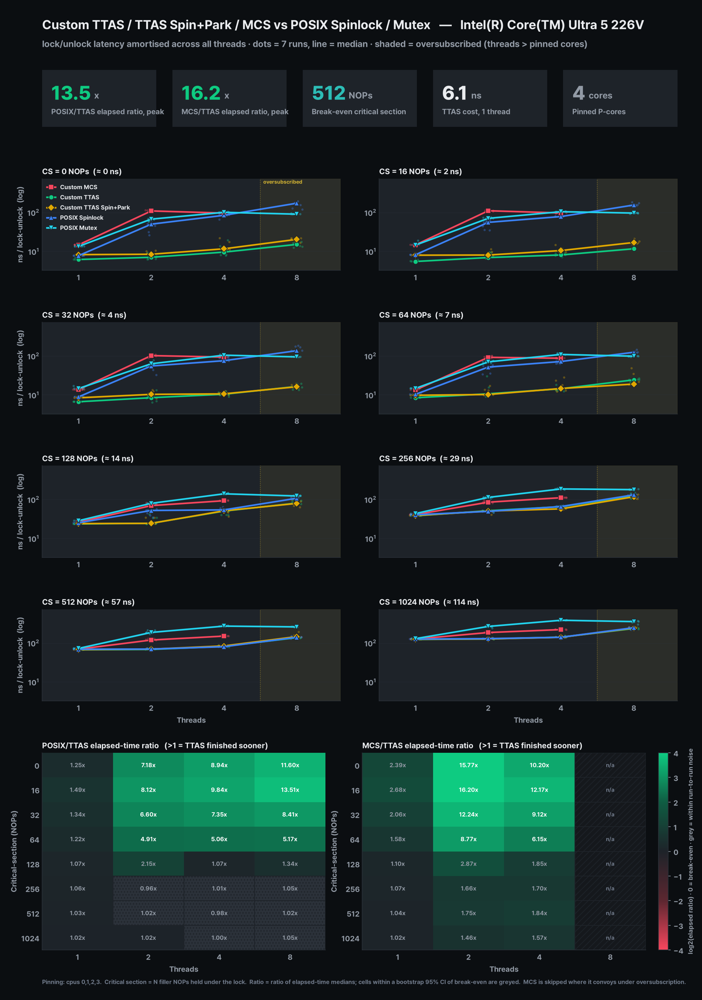

# Spinlock Implementation & Performance Test

This project provides custom spinlocks using architecture-specific inline assembly (x86-64 and aarch64) and compares them head-to-head with the POSIX spinlock (`pthread_spin_lock`) and the default POSIX mutex (`pthread_mutex_lock`). Three disciplines are exposed, each named for its algorithm and its wait policy: `spin_lock_ttas` (test-and-test-and-set with exponential backoff, pure spin), `spin_lock_ttas_park` (the same loop, but it sleeps 1 us per failed CAS once the backoff cap is reached) and `spin_lock_mcs` (an MCS queue lock, also usable with caller-supplied nodes). The benchmark allows granular control over threading, iteration counts, workload simulation, CPU pinning, timer slack, and which contenders run, via command-line arguments.

## Supported Platforms
- **Architecture**: x86-64 and aarch64. Each acquire/release primitive is emitted as architecture-specific inline assembly selected at compile time (`#if defined(__x86_64__)` / `__aarch64__`); any other target stops with a `#error`.
  - **x86-64**: `pause` spin hint, `lock cmpxchgl` acquire, and a plain store release — sufficient under the strong x86-TSO memory model.
  - **aarch64**: `yield` spin hint and an `stlr` store-release (a plain store is *not* a release on the weakly-ordered aarch64 memory model). The acquire is chosen at compile time:
    - **v8.1 LSE** (`__ARM_FEATURE_ATOMICS` defined): a single-instruction `casa` (load-acquire compare-and-swap). With no exclusive monitor to lose, it has no retry loop and scales far better under heavy contention. Enabled when the toolchain targets an LSE-capable CPU (e.g. `-march=armv8.1-a` or `-march=armv8-a+lse`).
    - **Baseline v8.0** (`-march=armv8-a`, no LSE): an `ldaxr`/`stlxr` load-acquire exclusive CAS retry loop with `clrex` on mismatch — the portable fallback used when LSE is unavailable.
- **Lock disciplines** (all on x86-64 and aarch64; a NULL lock pointer faults, it is not silently ignored):
  - **`spin_lock_ttas`** / **`spin_unlock_ttas`** — test-and-test-and-set with exponential backoff between failed CAS attempts (`-m`..`-M` pause iterations, default 4..16,000). Pure spin: a waiter never leaves the CPU. An uncontended acquire is a single CAS.
  - **`spin_lock_ttas_park`** — the same loop on the same `spinlock_ttas_t` (same init, same unlock), but once the backoff cap is reached every further failed CAS calls `nanosleep(1 us)`. Linux rounds that sleep up by the thread's timer slack (`/proc/self/timerslack_ns`, 50 us by default; real-time scheduling classes get zero slack), so a parked waiter is away for ~50 us while the holder re-acquires unopposed: throughput over fairness, and a policy the benchmark's `-S` flag makes visible.
  - **`spin_lock_mcs`** / **`spin_unlock_mcs`** — an MCS queue lock (tail swap via `xchg` / LSE `swpal` / LL-SC, hand-off via `stlr` / release store). Each waiter spins on its own cache line, so it is FIFO-fair and storm-free, at the cost of a cache-line transfer per hand-off; it convoys under oversubscription (a preempted successor stalls the whole queue). These single-argument wrappers use a per-thread node defined once in `spinlock.c` (`spin_mcs_thread_local_node`), so a lock taken in one translation unit may be released in another; they still must not nest, because one node can sit in only one queue at a time (the trace build aborts on a nested wrapper call). **`spin_lock_mcs_node(lock, node)`** / **`spin_unlock_mcs_node(lock, node)`** take an explicit, cache-line-aligned `mcs_node_t` and have neither limit:
    ```c
    spinlock_mcs_t lock;            /* spin_init_mcs(&lock) once */
    mcs_node_t node;                /* one per thread per held lock */
    spin_lock_mcs_node(&lock, &node);
    /* critical section */
    spin_unlock_mcs_node(&lock, &node);
    ```
- **OS**: Linux
- **Compilers**: GCC or Clang (Standard: `gnu99`)
- **Build Systems**: Make and CMake (≥ 3.16)
- **Build Modes** (both carry the same warning set, `-Wall -Wextra -Wshadow -Wformat=2 -Wstrict-prototypes -Wmissing-prototypes -Wpointer-arith -Wcast-qual -Wwrite-strings -Wvla -Wundef -Wnull-dereference -Wimplicit-fallthrough -Wdouble-promotion -Wconversion -Wsign-conversion`, and the same hardening, `-fstack-protector-strong -fstack-clash-protection -fcf-protection=full` (`-mbranch-protection=standard` on aarch64) `-fPIE -pie -Wl,-z,relro,-z,now,-z,noexecstack`; the code builds warning-free under both compilers):
  - **Release**: `-O3 -D_FORTIFY_SOURCE=3 -fno-omit-frame-pointer -fasynchronous-unwind-tables` — optimized for benchmarking with frame pointers and unwind tables preserved for `perf` and flame graphs. The hardening flags touch no instruction in the lock hot paths; an A/B run of old flags against new flags on this host stayed inside run-to-run noise.
  - **Trace/Debug**: `-O0 -g3 -DSPINLOCK_DEBUG -fno-inline -fno-inline-functions -fno-optimize-sibling-calls -rdynamic` — every `static inline` helper resolves to a real call frame so `uftrace`, `gdb`, `strace`, and `perf` can step into each function. `SPINLOCK_DEBUG` compiles in misuse checks that abort at the offending call: `spin_unlock_ttas` on a lock that is not held, `spin_unlock_mcs_node` on an empty queue, and a nested `spin_lock_mcs` wrapper call. Each check is a plain load on a path the caller already owns and never touches the lock protocol.
- **Code Style**: LLVM-based `.clang-format` — right-aligned pointers, Allman function braces, K&R control flow, 100-column soft limit.

## Build Instructions

Either build system produces the same artifacts under `bin/`. Use GCC or Clang interchangeably.

### Make

```bash
make clean
make all              # release + trace benchmark, both check binaries, and the
                      # editor indexes (compile_commands.json, tags, cscope.out)
# or build a single target:
make release          # ./bin/spinlock_test
make trace            # ./bin/spinlock_test_trace
make check-binaries   # ./bin/spinlock_check and ./bin/spinlock_check_trace
make index            # compile_commands.json + tags + cscope.out only

make check            # run the correctness suite on both check binaries
make sanitize         # rebuild the suite with ASan + UBSan and run it
make lsp-check        # let clangd parse every file and print its diagnostics
make tidy             # clang-tidy over every translation unit
```

Override the compiler with `make CC=clang all`.

### Editor integration: clangd, ctags, cscope

`make all` (or `make index`) writes three files into the source root, all ignored by git:

- **`compile_commands.json`** — one entry per translation unit with the exact release flags. clangd reads it and parses each `.c` file, and each header through the `.c` that includes it, as `gnu99` C for the compiler's target. Without this file clangd falls back to a bare `clang <file>`, which treats a `.h` as Objective-C++ and knows neither the standard nor `_GNU_SOURCE`: that fallback is where the spurious errors and missed real ones came from. The Makefile regenerates the file whenever the content would differ, so `make CC=aarch64-linux-gnu-gcc compdb` flips clangd to the aarch64 branch of `spinlock.h` (clangd reads the target from the compiler name) and `make compdb` flips it back.
- **`tags`** — Universal Ctags with prototypes, externs and qualified names (`--kinds-C=+px --fields=+iaSn --extras=+q`) over the project sources only.
- **`cscope.out`** (plus `cscope.files`, `cscope.in.out`, `cscope.po.out`) — built in kernel mode (`-k`) from the same file list, so it indexes the project and not `/usr/include`.

The checked-in **`.clangd`** adds `-ferror-limit=0`, strips the GCC-only flags clang would reject, keeps the include cleaner on (`UnusedIncludes: Strict`, with `MissingIncludes` off because glibc's transitive includes make it guess wrong), and enables a clang-tidy set (`bugprone-*`, `cert-*`, `clang-analyzer-*`, `misc-*`, `performance-*`, `portability-*`, `readability-*`) minus the checks that are noise on this code base: `cert-err33-c` (unchecked `printf` return values), `concurrency-mt-unsafe` (`getopt`/`strtol`/`exit` from a single-threaded `main`), `readability-use-concise-preprocessor-directives` (the `#if defined(...)` chains that keep `#elif` legible), `bugprone-reserved-identifier` (`_GNU_SOURCE`) and the magic-number / identifier-length / cognitive-complexity style checks. **`.clang-tidy`** mirrors that list so `make tidy` and the editor agree; both are clean on the current tree. `make lsp-check` runs `clangd --check` over every file with the database in place and fails on any diagnostic.

CMake users get the same indexes from `cmake --build build --target index`, which copies `build/compile_commands.json` to the source root and runs ctags and cscope there.

### CMake

```bash
cmake -S . -B build
cmake --build build -j
ctest --test-dir build          # runs both check binaries

# or with Clang:
CC=clang cmake -S . -B build
cmake --build build -j
```

### aarch64

On an aarch64 host, `make` and `cmake` work unchanged. To cross-build from an x86 host, just point the build at the cross compiler: the Makefile reads the target triple from `$(CC) -dumpmachine`, so an aarch64 compiler automatically gets the v8.0 baseline `-march=armv8-a` (the portable `ldaxr`/`stlxr` LL/SC atomics). Run the result under QEMU:

```bash
make CC=aarch64-linux-gnu-gcc
qemu-aarch64 -L /usr/aarch64-linux-gnu ./bin/spinlock_test -t 4 -l 0 -i 100000
```

To emit the single-instruction LSE atomics (`casa` acquire, `swpal`/`casl` for the MCS queue) instead of the LL/SC fallback, target an LSE-capable architecture via `ARCH_CFLAGS` (Make) or `-DARCH_LSE=ON` (CMake):

```bash
make CC=aarch64-linux-gnu-gcc ARCH_CFLAGS='-march=armv8.1-a'   # or -mcpu=neoverse-n1
cmake -S . -B build -DCMAKE_C_COMPILER=aarch64-linux-gnu-gcc -DARCH_LSE=ON && cmake --build build -j
```

A fully static binary (no sysroot needed to run under QEMU) can be built directly:

```bash
aarch64-linux-gnu-gcc -O3 -std=gnu99 -Wall -Wextra -static -march=armv8.1-a \
    spinlock.c spinlock_test.c main.c -o spinlock_test_arm64_lse -pthread
```

Confirm which path was compiled in by disassembling: `casa`/`swpal` means the LSE path, `ldaxr`/`stlxr` means the LL/SC fallback.

### Artifacts (in `bin/`)
- `./bin/spinlock_test` — **release build**, used for benchmarking and the headline numbers below.
- `./bin/spinlock_test_trace` — **trace/debug build**, used with `uftrace`, `gdb`, `strace`, `perf`, and other analysis tools. Inlining is fully suppressed and `-rdynamic` exposes all symbols, so every helper appears as a real call frame.
- `./bin/spinlock_check` / `./bin/spinlock_check_trace` — the **correctness suite** (see [Stability & Sanity Checks](#stability--sanity-checks)) built with the release and the trace flags; `make check` runs both. `SPINLOCK_CHECK_ITERATIONS=<n>` shrinks the contended passes, for example under valgrind.
- `./bin/spinlock_check_sanitize` — the suite under AddressSanitizer + UndefinedBehaviorSanitizer, built and run by `make sanitize`.

### Source layout
- `spinlock.h` — the three lock disciplines, header-only apart from the definitions below.
- `spinlock.c` — the backoff window (`g_conf_spin_min` / `g_conf_spin_max`, defaults `SPINLOCK_DEFAULT_SPIN_MIN` / `SPINLOCK_DEFAULT_SPIN_MAX`) and the thread-local MCS node behind the single-argument wrappers. Link it into every program that uses the header.
- `spinlock_test.h` / `spinlock_test.c` / `main.c` — the benchmark harness behind the `bench_*` API.
- `spinlock_check.c` — the correctness suite.

## Usage & Options

Run the binary directly from the command line. If no arguments are provided, default values are used.

```bash
./bin/spinlock_test [options]
```

### Command-Line Arguments

| Option | Argument | Description | Default |
| :--- | :--- | :--- | :--- |
| `-t` | `<threads>` | **Thread Count**: Number of concurrent worker threads to spawn. | `4` |
| `-i` | `<iters>` | **Iterations**: Number of critical section entries per thread. | `1,000,000` |
| `-l` | `<loops>` | **Workload**: Number of `nop` instructions to execute inside the critical section (simulates load). | `500` |
| `-m` | `<min>` | **Min Backoff**: Initial spin count for the exponential backoff algorithm. | `4` |
| `-M` | `<max>` | **Max Backoff**: Cap of the exponential backoff spin count (pause iterations; ~10 ns each on this host). `ttas_park` sleeps 1 us per failed CAS once the cap is reached. | `16,000` |
| `-C` | `<cpulist>` | **Pin**: Bind workers round-robin to these cores (e.g. `0-3` or `0,2,4`) for deterministic one-thread-per-core placement. Pass at least as many cores as threads from one homogeneous class (all P or all E) to control P/E-core variance. | none |
| `-K` | `<locks>` | **Contenders**: Comma-separated subset of `ttas,ttas_park,pspin,pmutex,mcs` to run. Drop `mcs` at thread counts that oversubscribe the cores, where the queue lock convoys. | all five |
| `-S` | `<ns>` | **Timer slack**: `prctl(PR_SET_TIMERSLACK)` for the process before the workers start; it stretches every `nanosleep` of `ttas_park`. `0` restores the kernel default, the smallest value is `1`. The effective value is printed in the header. | inherited (50,000 ns) |
| `-h` | N/A | **Help**: Display usage information and exit. | N/A |

The header also prints the measured cost of one workload loop iteration (`NOP Cost`, taken once at startup on the first pinned core) so critical-section sizes can be read in nanoseconds. Each contender prints a **`Fairness`** line: the earliest and latest per-thread completion time measured from the start barrier, and their ratio (`min/max`; `1.00` means every thread finished together, a small value means one thread ran through while the others waited).

### Execution Examples

#### 1. Default Run
Use standard settings (optimized for general testing).
```bash
./bin/spinlock_test
```

#### 2. High Contention Test
Simulate heavy contention with 8 threads and a very short critical section.
```bash
./bin/spinlock_test -t 8 -l 0
```

#### 3. Long Critical Section Test
Simulate a scenario where the lock is held for a longer duration (10,000 nops), which narrows the gap between the spinlocks as raw acquire cost is amortized over the critical section.
```bash
./bin/spinlock_test -l 10000
```

#### 4. Tuning Backoff Algorithm
Adjust the exponential backoff parameters to optimize for specific hardware (e.g., Intel Core Ultra or aarch64 Cortex/Neoverse cores).
```bash
./bin/spinlock_test -m 16 -M 4096
```

#### 5. Controlled Run (pinning + contender selection)
Pin all workers to the four P-cores for low-variance, deterministic placement, and compare only the TTAS lock against POSIX (dropping the MCS queue lock):
```bash
./bin/spinlock_test -t 4 -C 0-3 -K ttas,pspin
```

#### 6. Timer Slack
Run the parking TTAS and the POSIX mutex with a 1 ns timer slack, so `nanosleep(1 us)` returns after ~2 us instead of ~50 us:
```bash
./bin/spinlock_test -t 4 -C 0-3 -l 0 -S 1 -K ttas_park,pmutex
```

## Profiling & Tracing the Trace Build

The trace build (`./bin/spinlock_test_trace`) suppresses inlining and ships full debug info, so every `static inline` helper resolves to a real call frame. Common workflows:

```bash
# Function-level user-space trace (uftrace)
uftrace ./bin/spinlock_test_trace -t 8 -l 0 -i 100000

# Hot-path sampling with perf (DWARF call graph)
perf record -F 999 --call-graph dwarf ./bin/spinlock_test_trace -t 8 -l 0 -i 100000
perf report

# Single-step into spin_lock_ttas under gdb
gdb -ex 'b spin_lock_ttas' --args ./bin/spinlock_test_trace -t 2 -l 0 -i 1000

# Syscall summary
strace -c ./bin/spinlock_test_trace -t 4 -l 0 -i 100000

# Valgrind: memory errors, thread races, cache profile
valgrind --tool=memcheck --leak-check=full ./bin/spinlock_test_trace -t 2 -l 0 -i 1000
valgrind --tool=helgrind                    ./bin/spinlock_test_trace -t 4 -l 0 -i 1000
valgrind --tool=drd                         ./bin/spinlock_test_trace -t 4 -l 0 -i 1000
valgrind --tool=cachegrind                  ./bin/spinlock_test_trace -t 2 -l 500 -i 10000
```

All commands above run unchanged on an aarch64 host. To drive a cross-built aarch64 binary from an x86 host, wrap it in QEMU's gdbstub and attach the cross debugger:

```bash
qemu-aarch64 -g 1234 ./spinlock_test_arm64_trace -t 2 -l 0 -i 1000 &
aarch64-linux-gnu-gdb -ex 'target remote :1234' -ex 'b spin_lock_ttas' ./spinlock_test_arm64_trace
```

Use `make distclean` to scrub every debugger / profiler / tracer artifact (cores, valgrind dumps, perf.data, uftrace.data, `__pycache__`, CMake residue, …) on top of `make clean`'s build-only sweep.

The release build (`./bin/spinlock_test`) is what `test_bench.py` exercises and what produces the headline numbers below.

## Benchmark Results
*Test environment: Intel Core Ultra 5 226V (4 P-cores @ 4.5 GHz + 4 E-cores @ 3.5 GHz), Arch Linux, kernel `7.2.6-arch2-1`, GCC 16.2.1 release build (`-O3`), default timer slack 50,000 ns (`/proc/self/timerslack_ns`). Workers pinned to the four P-cores (`-C 0-3`). Every number below is the median of 5 runs of `./bin/spinlock_test`, 1,000,000 iterations per thread unless stated; `ns/acq` is elapsed time divided by the total number of acquisitions. On this core a `pause` costs ≈ 10.4 ns, so the default backoff cap `-M 16000` is a ≈ 167 us spin between two CAS attempts, and the measured NOP cost is 0.111 ns.*

**What the harness rewards.** Each thread performs a fixed number of acquisitions and the elapsed time is the wall time until the *last* thread finishes; there is no fairness term. On the same four cores every lock pays the same physical cost for a contended hand-off: the lock word (or the MCS flag) has to move between cores, ≈ 90–100 ns per acquisition here, which is exactly where the POSIX spinlock, the POSIX mutex and MCS all land. Two locks that hand the lock over on every acquisition therefore cannot differ by 5–11x on this machine. A lock that finishes several times sooner is doing different work: its waiters stay away from the lock (a 167 us backoff spin, a 50 us park) while one thread re-acquires uncontended at ≈ 9 ns, and the fixed-iteration metric rewards that. The fairness column exposes it — `min/max` is the ratio of the earliest to the latest per-thread completion time; `1.00` means the lock was handed around evenly, `0.4–0.6` means one thread ran through while the others waited.

### 4 threads, empty critical section (`-t 4 -C 0-3 -l 0`)

| Lock | Elapsed (ms) | ns/acq | Fairness min (ms) | max (ms) | min/max |
| :--- | ---: | ---: | ---: | ---: | ---: |
| `ttas` (pure spin, `-M 16000`) | 36.7 | 9.2 | 19.2 | 36.7 | 0.59 |
| `ttas_park` (spin, then 1 us park) | 47.8 | 11.9 | 16.8 | 47.7 | 0.39 |
| `pspin` (`pthread_spin_lock`) | 360.8 | 90.2 | 268.7 | 360.8 | 0.70 |
| `pmutex` (`pthread_mutex_lock`) | 402.4 | 100.6 | 382.0 | 402.4 | 0.95 |
| `mcs` | 402.0 | 100.5 | 401.7 | 401.9 | 1.00 |

`pspin` at 4 threads is bimodal from run to run (≈ 260 ms at min/max ≈ 0.2, or ≈ 400 ms at ≈ 0.7); the median above fell on the slower mode.

The 9 ns/acq of `ttas` is close to the uncontended single-thread cost (6 ns): with the 167 us backoff every CAS miss removes a waiter for tens of thousands of acquisitions, so the four threads effectively run one after another. Removing the sleep does not remove that; the backoff cap does (see the `-M` sweep below).

### Timer slack (`-S`)

`ttas_park` sleeps 1 us per failed CAS once the cap is reached, and Linux rounds `nanosleep` up by the timer slack. Measured on a P-core, `nanosleep(1 us)` returns after ≈ 50 us at the default slack and after a few microseconds at `-S 1000` or `-S 1`. Note that `prctl(PR_SET_TIMERSLACK, 0)` *restores the kernel default* (the header shows `Timer Slack : 50000 ns` for `-S 0`); `-S 1` is the smallest slack, and real-time scheduling classes get zero slack without any flag.

| `-t 4 -l 0`, lock | slack 50,000 ns | slack 1,000 ns | slack 1 ns |
| :--- | ---: | ---: | ---: |
| `ttas_park` elapsed (ms) / min/max | 47.8 / 0.39 | 45.5 / 0.54 | 46.4 / 0.55 |
| `ttas` elapsed (ms) / min/max | 36.7 / 0.59 | 32.6 / 0.48 | 31.1 / 0.45 |

With the default `-M 16000` the park is a 50 us tail on a 167 us spin, so the slack barely moves the total. It dominates once the backoff is short:

| `-t 4 -l 0 -M 64`, lock | slack 50,000 ns | slack 1,000 ns | slack 1 ns |
| :--- | ---: | ---: | ---: |
| `ttas_park` elapsed (ms) / min/max | 43.7 / 0.75 | 78.2 / 0.71 | 97.3 / 0.69 |
| `ttas` elapsed (ms) / min/max (no sleep, reference) | 199.0 / 0.90 | 188.7 / 0.88 | 191.8 / 0.90 |

With `-M 64` the park is the whole wait and the slack sets its length: over 2,000 samples on a P-core, `nanosleep(1 us)` returns after a median of 52.0 us at the default slack, 3.1 us at `-S 1000` and 1.9 us at `-S 1`. Shortening it brings the parked waiters back sooner, and `ttas_park` goes from 43.7 ms to 97.3 ms (2.2x) with no code change, while the pure-spin `ttas` reference stays at ≈ 190 ms. A `ttas_park` result is therefore a property of the kernel's timer slack as much as of the lock; report `-S` (or the header's `Timer Slack`) with it.

### Backoff cap (`-M`, 4 threads, empty critical section)

| `-M` (pause iterations ≈ spin time) | `ttas` elapsed (ms) / ns/acq / min/max | `ttas_park` elapsed (ms) / min/max | `pspin` elapsed (ms) / min/max |
| :--- | ---: | ---: | ---: |
| 64 (≈ 0.7 us) | 199.0 / 49.7 / **0.90** | 43.7 / 0.75 | 348.6 / 0.49 |
| 1,024 (≈ 11 us) | 44.8 / 11.2 / 0.46 | 52.5 / 0.65 | 345.1 / 0.64 |
| 16,000 (≈ 167 us, default) | 36.7 / 9.2 / 0.59 | 47.8 / 0.39 | 360.8 / 0.70 |

This is the like-for-like comparison of the two pure spinlocks. With a sub-microsecond cap `ttas` hands the lock around (min/max 0.90) and still finishes 1.75x sooner than `pthread_spin_lock`, whose waiters never back off and keep bouncing the lock line: that is the real benefit of TTAS with backoff. Raising the cap to 1,024 pauses turns the same lock into a serialiser: 4x "faster" at min/max 0.46. `ttas_park` serialises at every cap because its ≈ 50 us park outlasts all of these spins. The `-M 64` rows at 1,000 ns and 1 ns slack are in the timer-slack section above.

### Oversubscription on the four P-cores (`-t 8` and `-t 16`, `-l 0`)

| Lock | 8 threads: elapsed (ms) | ns/acq | min/max | 16 threads: elapsed (ms) | ns/acq | min/max |
| :--- | ---: | ---: | ---: | ---: | ---: | ---: |
| `ttas` | 99.8 | 12.5 | 0.39 | 456.6 | 28.5 | 0.38 |
| `ttas_park` | 143.7 | 18.0 | 0.39 | 399.2 | 24.9 | 0.45 |
| `pspin` | 1,284.9 | 160.6 | 0.68 | 4,963.7 | 310.2 | 0.60 |
| `pmutex` | 731.1 | 91.4 | 0.97 | 1,603.7 | 100.2 | 0.84 |
| `mcs` (10,000 / 5,000 iterations per thread) | 39,290 | 491,000 | 0.65 | 129,543 | 1,619,000 | 0.43 |

Once threads outnumber cores the lock holder gets preempted. The POSIX spinlock's waiters spin through their whole timeslice (160 → 310 ns/acq); the mutex parks them in the kernel and stays at ≈ 100 ns/acq, so `pmutex` beats `pspin` by 1.8x at 8 threads and 3.1x at 16. MCS collapses: a preempted successor stalls the whole queue for a scheduler quantum, ≈ 0.5 ms per acquisition at 8 threads and 1.6 ms at 16 (measured with 10,000 and 5,000 iterations per thread; a 1,000,000-iteration run would take about an hour), which is why the sweep drops it above the core budget. `ttas` and `ttas_park` still post the smallest elapsed times, but at min/max ≈ 0.4: they serialise the threads rather than scale. `ttas_park` overtakes `ttas` at 16 threads because a parked waiter gives its core back to the holder.

### A longer critical section (`-t 4 -l 4096`, ≈ 0.46 us held)

| Lock | 1 thread (ms) | 4 threads (ms) | min/max |
| :--- | ---: | ---: | ---: |
| `ttas` | 472.6 | 2,143.8 | 0.55 |
| `ttas_park` | 470.6 | 2,144.4 | 0.52 |
| `pspin` | 472.6 | 2,090.7 | 0.37 |
| `pmutex` | 479.2 | 3,430.9 | 0.98 |
| `mcs` | 471.2 | 2,657.8 | 1.00 |

The critical section dominates: 4 × 472 ms = 1,889 ms of serialised work is the floor. The three spinlocks land within 11–14% of it and their ordering is gone (`ttas`/`pspin` = 0.98x). MCS adds ≈ 190 ns per hand-off, the mutex ≈ 385 ns: with a 0.46 us hold every acquisition is contended, so every mutex hand-off goes through a futex wake. The spinlocks' min/max stays at 0.4–0.55 because a released lock goes to whichever waiter sees it first, and the backoff still delays the losers.

### Uncontended cost (`-t 1 -l 0`, ns per lock/unlock pair)

`ttas` 6.1 · `ttas_park` 8.2 · `pspin` 7.7 · `pmutex` 13.4 · `mcs` 14.6. Single-threaded, the custom TTAS lock is 1.6 ns ahead of `pthread_spin_lock`; under contention its honest advantage is the `-M 64` row of the backoff-cap table, not the default-cap headline.

## Automated Benchmarking & Visualization

Measurement and visualization are split into two scripts, so the plot can be iterated on without touching benchmark code:

- **`test_bench.py`** runs the sweep — thread counts × workload intensities × the five contenders, aggregated as **Median ± MAD** over **7 runs (+ 1 discarded warmup)** — and writes the raw CSV of every measurement (`bench_results.csv`), a run-context sidecar (`bench_meta.json`, including the measured NOP cost and timer slack read from the harness header), and a textual report. To control variance it auto-detects the highest-frequency core group (the P-cores on a heterogeneous P/E or big.LITTLE machine) and pins every worker to it via `-C`, sizing the thread sweep to that pinned set; `--no-pin` disables it. When the sweep finishes it hands off to the visualizer.
- **`plot.py`** renders the dashboard (`bench_result.png`) from the committed CSV alone. Run `python3 plot.py` to redraw after editing the plot, or `python3 test_bench.py --plot-only` for the same thing — both read the CSV and never modify it.

The dashboard is a dark board (Binance-style design-system palette):

- A **KPI strip** of headline numbers — the largest POSIX/TTAS and MCS/TTAS elapsed-time ratios (a serialisation effect at short critical sections, see above), the break-even critical-section size, TTAS's single-thread cost, and the pinned core count.
- **Eight scaling panels** (one per critical-section size, titled with its size in NOPs and in nanoseconds from the measured NOP cost), each plotting **nanoseconds per lock/unlock vs thread count** on a shared log axis. Each lock is a coloured line through its **median**, with the **7 individual runs drawn as a faint dot strip** so the sample size is self-evident; the region where threads exceed the pinned cores is shaded **oversubscribed** (it degrades every lock, not just MCS). Latency is amortised across all threads (elapsed ÷ total ops), so a rising line is genuine contention overhead rather than just more work retired — it is the same measurement the results table reports as ms per 1M per-thread ops, divided by the thread count. Read it together with the harness's fairness line: amortised latency rewards a lock that lets one thread run through while the others wait.
- **Two elapsed-time ratio heatmaps** (POSIX/TTAS and MCS/TTAS) over critical-section × threads, sharing one colour scale so the two are directly comparable. Colour is `log2(ratio)` diverging around break-even (green = TTAS finished sooner, red = later, per the trading up/down semantic); cells whose ratio sits **within a bootstrap 95% CI of break-even are greyed** instead of being painted as a decisive winner, and MCS's oversubscribed column is hatched `n/a`.

**Why the MCS line stops at the pinned core count.** MCS is a *strict FIFO queue* lock, so under oversubscription (more threads than pinned cores) it **convoys**: when the scheduler preempts the thread whose turn it is, every thread queued behind it stalls until that one successor is rescheduled again, and wall-clock time explodes (≈ 0.5 ms per acquisition at 8 threads on 4 cores here, versus ≈ 0.1 us subscribed), often to a timeout that would also starve the other contenders' samples. Test-and-set locks (TTAS, `pthread_spin_lock`) degrade under oversubscription but do not collapse this way. The sweep therefore drops MCS for thread counts above the pinned core budget (`run_mcs = t <= core_budget` in `test_bench.py`) rather than let a convoyed, timeout-dominated cell distort the comparison; on the machine below (4 pinned P-cores) that means MCS is measured at 1/2/4 threads and shown as `n/a` at 8. It is not a zero and not a win — and because the whole 8-thread column is oversubscribed for *every* lock, that regime is shaded so the caveat attaches to all five.

The lock colours follow the trading-semantics palette — **TTAS** green (up), **MCS** red (down), **POSIX spinlock** blue (info) — extended with **TTAS Spin+Park** amber and **POSIX mutex** cyan, each with a distinct marker, so the series stay separable under colour-vision deficiency and after the image is downscaled (thin marks that vanish on GitHub's down-sampling are avoided by construction). Type is set in Pretendard.

The critical section is emulated with N filler NOPs; the harness measures the cost of that loop at startup and prints it as `NOP Cost` (≈ 0.11 ns/NOP on this CPU), which the report and the plot use to label sizes in nanoseconds. The workload range is a powers-of-two sweep, deliberately dense in the regime where a spinlock is the right tool — small, fast updates to shared state: `0` (pure lock contention, no CS), `16`/`32`/`64` (≈ 2–7 ns: a flag flip, a pointer swap, a couple of struct fields), `128`/`256` (≈ 14–29 ns: a small struct), `512` (≈ 57 ns), and `1,024` (≈ 114 ns, a medium CS shown for context). Heavier critical sections are intentionally omitted: holding a busy-wait spinlock that long is the wrong design, so benchmarking it would not inform a real spinlock choice.

**Measurement isolation.** To keep external interference out of each measurement, every benchmark process pins its workers to a homogeneous core set (see above), locks its resident pages into RAM (`mlockall(MCL_CURRENT)`, best-effort), warms every contender, and inserts a quiescent settle gap both between consecutive in-process lock measurements (`SETTLE_DELAY_MS`, default 100 ms) and between consecutive process launches (`SETTLE_SEC`, default 0.3 s) so one run cannot bias the next.

The full raw measurement table (8 workloads × 4 thread counts × 5 locks — Custom TTAS, Custom TTAS Spin+Park, Custom MCS, POSIX spinlock and POSIX mutex — × 7 runs, with MCS omitted at the oversubscribed 8-thread point) is shipped as [`bench_results.csv`](bench_results.csv) for downstream analysis.



## Stability & Sanity Checks

### Correctness suite (`make check`)

`spinlock_check.c` tests the locks with oracles that hold no matter what the tooling can see. Every contended pass runs up to 8 worker threads (bounded by the online CPU count) for 100,000 acquisitions each and checks three things after the threads join: an **overlap detector** (an `__atomic` counter incremented on entry to the critical section and decremented on exit, independent of the lock under test) recorded zero moments with two threads inside, the **protected counter** equals threads × iterations, and the lock's own word is back in its idle state (`is_locked == 0`, `queue_tail == NULL`). The detector is first run against a deliberately broken no-op lock and must report violations, so it is shown to be able to fail before it is trusted. The suite covers:

- `ttas` and `ttas_park` under contention, the latter with the backoff cap forced to 8 so every waiter really parks;
- the MCS single-argument wrapper, the explicit-node API with a heap node per thread, and two MCS locks nested per thread through two nodes;
- uncontended state transitions of every API (`is_locked` toggles, `queue_tail` points at the holder's node and returns to `NULL`, a failed CAS leaves the word untouched), the cache-line size and alignment of every type including the thread-local node, that the wrapper node is really per thread (a second thread queues behind it instead of sharing it), and that the backoff loop survives caps of `1`, `INT_MAX`, and a minimum above the maximum;
- in the trace build, that each `SPINLOCK_DEBUG` misuse check aborts the process (each case runs in a forked child and must end with `SIGABRT`).

Both check binaries pass on x86-64 with GCC and Clang, and both pass under `qemu-aarch64` for the v8.0 LL/SC build (`-march=armv8-a`) and the v8.1 LSE build (`-march=armv8.1-a`).

### Validators

The trace build (`./bin/spinlock_test_trace`) and the check suite were exercised under several validators (all five contenders selected):

| Tool | Scope | Result |
| :--- | :--- | :--- |
| **Stress matrix** (5 thread × 3 workload × 2 iter × 5 lock = 150 runs, `-C 0-3`) | atomic-count correctness | **150/150 OK** |
| **valgrind memcheck** (`--leak-check=full`, benchmark and check suite) | memory errors / leaks | **0 errors** |
| **valgrind drd** | data races | **0 errors** |
| **valgrind helgrind** | data races | 60 errors / 10 contexts (false positives, custom locks only); **0 errors** with `-K pspin,pmutex` |
| **AddressSanitizer + UBSan** (`make sanitize`, GCC and Clang) | memory + UB | **clean, 16/16 checks pass** |
| **ThreadSanitizer** (`-fsanitize=thread`) | data races | a few warnings, count varies run to run (false positives, custom locks only), atomic count OK |

One tool finding was itself a false positive and is documented rather than worked around in the code: GCC 16's `-fsanitize=null` reports `member access within null pointer` for the extern thread-local MCS node when the code is compiled at `-O1` with the initial-exec or dynamic TLS models. The address is non-null at run time (checked in gdb: the handler is called with a literal `0` while `&spin_mcs_thread_local_node` reads a valid address), the report vanishes at `-O0`, under Clang, and with `-ftls-model=local-exec`. `make sanitize` therefore builds with `-ftls-model=local-exec`, which is the correct model for an executable that defines all of its own thread-locals.

The helgrind / TSan warnings are **expected**: both detectors only recognise synchronization expressed through `pthread` primitives or C11 `<stdatomic.h>`, and our spinlocks acquire through raw atomic instructions (TTAS: `lock cmpxchgl` on x86-64; an `ldaxr`/`stlxr` load-acquire CAS — or a single `casa` load-acquire CAS under v8.1 LSE — with an `stlr` release on aarch64. MCS: `xchg`/`lock cmpxchg` on x86-64; `swpal`/`casl` under LSE or `ldaxr`/`stlxr` LL/SC, with `ldar`/`stlr` hand-off, on aarch64) over `volatile`-qualified words, which they cannot pattern-match; every flagged stack is in `ttas_acquire`, `spin_unlock_ttas` or the MCS task, none in the `pspin`/`pmutex` contenders. `drd` ignores them because of how it tracks vector clocks per memory access. None of the tools reported a memory error and every run produced the expected atomic count. A NULL lock pointer is not checked: `spin_lock_ttas(NULL)` and the other four entry points fault with `SIGSEGV`. The trace build's `SPINLOCK_DEBUG` checks catch the other misuse class, releasing a lock that is not held and nesting the MCS wrapper, by aborting at the call site.

The results above are from the x86-64 build. On aarch64, correctness is established by construction: for **all three** lock disciplines every acquire/release path is confirmed by per-function disassembly (`ttas_cas_acquire`: `casa` under `-march=armv8.1-a`, `ldaxr`/`stlxr`/`clrex` on baseline `-march=armv8-a`; `mcs_swap_tail`: `swpal` / `ldaxr`+`stlxr`; `mcs_cas_tail_null`: `casl` / `ldxr`+`stlxr`; releases via `stlr`, acquires via `ldar`), both builds compile warning-free at `-O3` and `-O0`, and the atomic-count oracle passes under QEMU (`qemu-aarch64`) for both builds and all five contenders at 4 and 8 threads, with and without `-S`. Note that QEMU-user does not reproduce weak-memory reordering, so the guarantee rests on the architecturally-correct acquire/release barriers rather than on the emulator.
